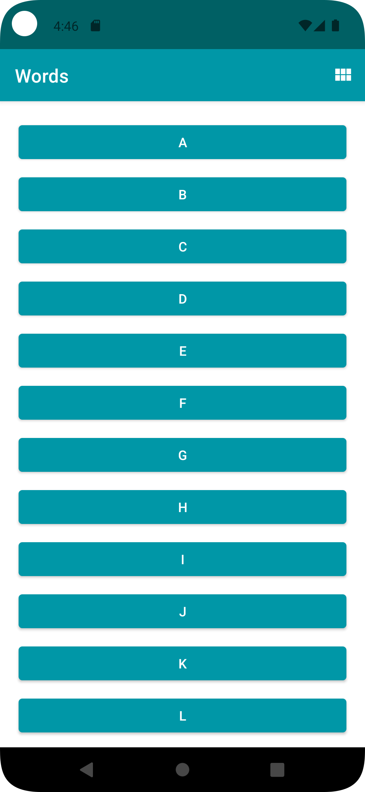
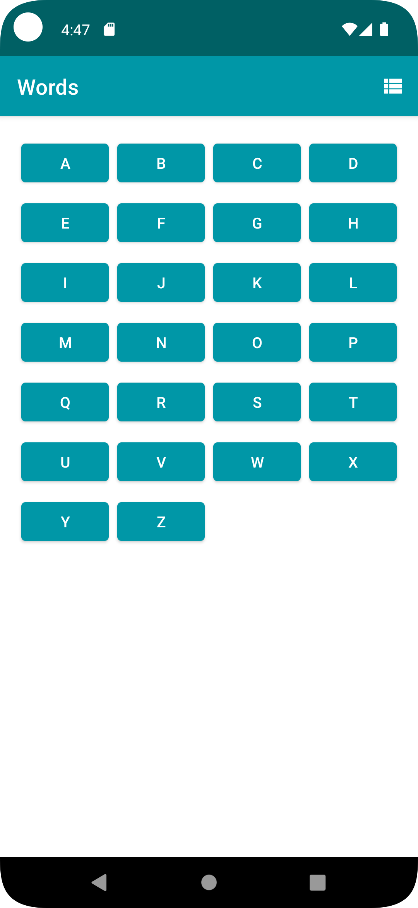
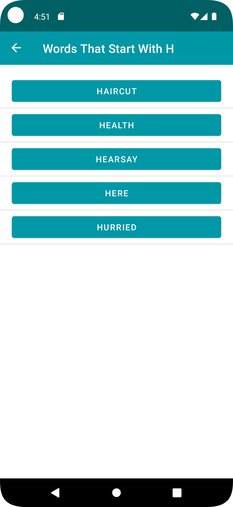
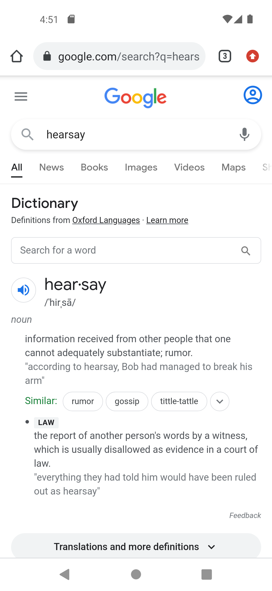

# Words App


<h2>Contents</h2>
Words app allows you to select a letter and use Intents to navigate to an Activity that
presents a number of words starting with that letter. Each word can be looked up via a web search.

Words app contains a scrollable list of 26 letters A to Z in a RecyclerView. The orientation
of the RecyclerView can be changed between a vertical list or a grid of items.

The app demonstrates the use of Intents in two ways:
* to navigate inside an app by specifying an explicit destination, and,
* allowing Android to service the Intent using the apps and resources present on the device.


## Installation
Clone this repository and import into **Android Studio**
```bash
git clone https://github.com/affi1504/words_app.git
```

<h3>Building by downloading .zip and using Android Studio...</h3>

1. Dowload the .zip file by clicking *Code* -> Download ZIP
1. Extract the .zip file
1. Open Android Studio
1. select *Open*
1. Select the **words_app** directory.
1. Ensure the Project gets build and in case the IDE asks to sync *click* **Sync Now**.
1. Run the App using a Physical device or Emulator

# Screenshots
[](screenshots/Screenshot_1.png)
[](screenshots/Screenshot_2.png)
[](screenshots/Screenshot_3.png)
[](screenshots/Screenshot_4.png)
